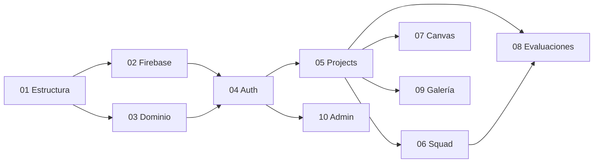

# 🗺️ IntegradorHub: Roadmap de Desarrollo Modular

> **Proyecto:** IntegradorHub - DSM Edition  
> **Stack:** .NET 8/9 (Backend) + React 18 + Vite (Frontend) + Firebase/Firestore  
> **Arquitectura:** Vertical Slice + CQRS con MediatR

---

## 📦 Módulos de Desarrollo

Este roadmap divide el proyecto en **10 módulos secuenciales**. Cada módulo tiene su propio archivo `.md` con instrucciones detalladas.

| # | Módulo | Descripción | Dependencias |
|---|--------|-------------|--------------|
| 01 | [Estructura Base](./01_ESTRUCTURA_BASE.md) | Crear carpetas, configurar solución .NET y proyecto Vite | Ninguna |
| 02 | [Configuración Firebase](./02_CONFIG_FIREBASE.md) | Setup de Firebase Admin SDK, Firestore, Storage | Módulo 01 |
| 03 | [Dominio y Entidades](./03_DOMINIO_ENTIDADES.md) | Definir User, Project, Group, CanvasBlock | Módulo 01 |
| 04 | [Auth & Identificación](./04_AUTH_IDENTIFICACION.md) | Google Auth + Regex de correo institucional | Módulo 02, 03 |
| 05 | [Feature: Projects CRUD](./05_FEATURE_PROJECTS.md) | Crear, editar, eliminar proyectos | Módulo 03, 04 |
| 06 | [Feature: Squad Management](./06_FEATURE_SQUAD.md) | Filtro por grupo, agregar miembros, Tooltip | Módulo 05 |
| 07 | [Canvas Editor (Notion)](./07_CANVAS_EDITOR.md) | Editor de bloques estilo Notion | Módulo 05 |
| 08 | [Evaluaciones Docentes](./08_EVALUACIONES.md) | Feedback técnico, cola de revisión | Módulo 05, 06 |
| 09 | [Galería Pública](./09_GALERIA_PUBLICA.md) | Showcase para invitados, filtros por stack | Módulo 05 |
| 10 | [Admin Panel](./10_ADMIN_PANEL.md) | Gestión de catálogos, cierre de ciclo | Módulo 04 |

---

## 🚀 Orden Sugerido de Ejecución

---

## 📊 Estimación de Complejidad

| Módulo | Complejidad | Tiempo Estimado |
|--------|-------------|-----------------|
| 01 - Estructura Base | 🟢 Baja | 1 sesión |
| 02 - Firebase Config | 🟡 Media | 1 sesión |
| 03 - Dominio | 🟡 Media | 1 sesión |
| 04 - Auth | 🔴 Alta | 2 sesiones |
| 05 - Projects CRUD | 🔴 Alta | 2-3 sesiones |
| 06 - Squad | 🔴 Alta | 2 sesiones |
| 07 - Canvas | 🔴 Alta | 2-3 sesiones |
| 08 - Evaluaciones | 🟡 Media | 1-2 sesiones |
| 09 - Galería | 🟡 Media | 1 sesión |
| 10 - Admin | 🟡 Media | 1-2 sesiones |

---

## ✅ Checklist de Progreso

- [ ] Módulo 01: Estructura Base
- [ ] Módulo 02: Configuración Firebase
- [ ] Módulo 03: Dominio y Entidades
- [ ] Módulo 04: Auth & Identificación
- [ ] Módulo 05: Feature Projects
- [ ] Módulo 06: Feature Squad
- [ ] Módulo 07: Canvas Editor
- [ ] Módulo 08: Evaluaciones
- [ ] Módulo 09: Galería Pública
- [ ] Módulo 10: Admin Panel

---

## 📚 Referencias Rápidas

- **Regex Alumno:** `^(\d{8})@utmetropolitana\.edu\.mx$`
- **Regex Docente:** `^[a-zA-Z.]+@utmetropolitana\.edu\.mx$`
- **Estados Proyecto:** `borrador` → `privado` → `publico` → `historico`
- **Roles:** `alumno`, `docente`, `invitado`, `admin`
